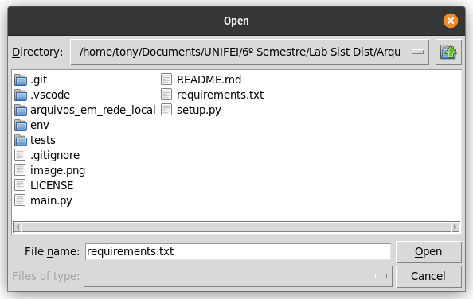

# ArquivosEmRedeLocal

Este projeto é uma aplicação para compartilhamento de arquivos em rede local, desenvolvido como trabalho final da disciplina Sistemas Distribuídos da UNIFEI.

## Funcionalidades

- Compartilhamento de arquivos entre dispositivos na mesma rede local
- Suporte a múltiplos formatos de arquivos

## Pré-requisitos

- Python 3.6 ou superior

## Como instalar

```bash
pip install .
```

## Como usar

```bash
arquivos_em_rede_local
```

## Exemplo de uso

Aqui estão alguns prints do programa em funcionamento:

### Tela Inicial


### Upload de Arquivos



### Download de Arquivos


## Como desinstalar

```bash
pip uninstall arquivos_em_rede_local
```